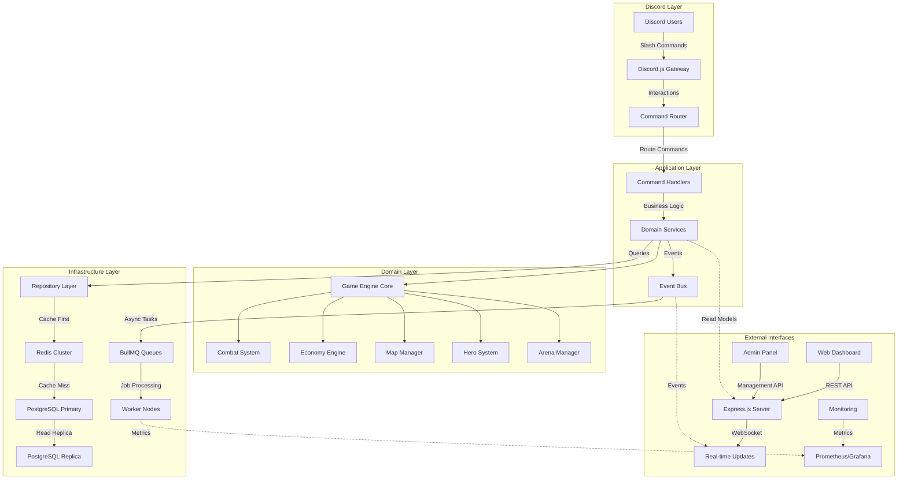

# Design Document

## Overview   

PopVerse Kingdoms is a sophisticated Discord-based strategy MMO that merges real-time territory warfare, hero collection mechanics, and competitive PvP systems into a cohesive 3-month seasonal experience. The game supports 50-100 concurrent players per Discord server, featuring three asymmetrically balanced factions (Cinema/Fire, Otaku/Wind, Arcade/Water) competing across a dynamically generated 100x100 tile persistent world.

The technical architecture employs a microservices-inspired modular design built on Node.js 20+ with ES modules, leveraging Discord.js v14 for real-time interaction handling, PostgreSQL with JSONB for hybrid relational/document storage, Redis for high-performance caching and session management, and BullMQ for distributed task processing. An optional React-based web dashboard provides advanced visualization and real-time march tracking through WebSocket integration.

**Key Innovation:** Unlike traditional Discord bots that rely on simple command-response patterns, PopVerse Kingdoms implements a persistent world simulation with real-time timers, complex state management, and event-driven architecture that maintains game state continuity even when players are offline.

## Architecture

### System Architecture Philosophy

The architecture follows **Domain-Driven Design (DDD)** principles with **Event Sourcing** for critical game state changes, ensuring data consistency and enabling features like battle replay, audit trails, and rollback capabilities. The system is designed for **horizontal scalability** through sharding and **fault tolerance** through graceful degradation patterns.



### Advanced Technology Stack

**Core Runtime Environment:**
- **Node.js 20.x LTS** with native ES modules, worker threads for CPU-intensive operations
- **TypeScript 5.x** for type safety and enhanced developer experience
- **PM2 Ecosystem** with cluster mode utilizing all CPU cores
- **Docker Compose** for containerized deployment with service orchestration

**Discord Integration Layer:**
- **discord.js v14.14+** with full slash command support and interaction handling
- **Custom middleware pipeline** for authentication, rate limiting, and command validation
- **Sharding manager** for multi-server deployment (when scaling beyond single server)
- **Webhook integration** for external event notifications

**Data Persistence & Caching:**
- **PostgreSQL 15+** with advanced features:
  - JSONB columns for flexible schema evolution
  - Partial indexes for query optimization
  - Row-level security for multi-tenant isolation
  - Logical replication for read scaling
- **Redis 7.x Cluster** with:
  - Keyspace partitioning for horizontal scaling
  - Pub/Sub for real-time event distribution
  - Lua scripting for atomic operations
  - Persistence with AOF and RDB snapshots

**Task Processing & Scheduling:**
- **BullMQ 4.x** with Redis-backed job queues:
  - Delayed job execution for march timers
  - Job prioritization for critical operations
  - Retry mechanisms with exponential backoff
  - Dead letter queues for failed job analysis
- **Node-Cron** for periodic maintenance tasks
- **Custom scheduler** for game event timing (Conquest, daily resets)

**Web Dashboard & API:**
- **Express.js 4.x** with TypeScript and middleware composition
- **Socket.io** for real-time map updates and march tracking
- **React 18** with TypeScript for the frontend dashboard
- **Leaflet.js** for interactive map rendering with custom tile layers
- **JWT authentication** with refresh token rotation

**Monitoring & Observability:**
- **Prometheus** with custom metrics for game-specific KPIs
- **Grafana** dashboards for real-time monitoring and alerting
- **Sentry** for error tracking and performance monitoring
- **Winston** structured logging with log aggregation
- **Health check endpoints** for service monitoring

### Detailed System Architecture

```
popverse-kingdoms/
├── src/
│   ├── application/           # Application layer (Use Cases)
│   │   ├── commands/         # Command handlers (CQRS pattern)
│   │   │   ├── AttackCommand.ts
│   │   │   ├── BuildCommand.ts
│   │   │   └── ArenaCommand.ts
│   │   ├── queries/          # Query handlers for read operations
│   │   │   ├── MapQuery.ts
│   │   │   ├── PlayerQuery.ts
│   │   │   └── LeaderboardQuery.ts
│   │   └── events/           # Event handlers
│   │       ├── BattleResolvedEvent.ts
│   │       └── ResourceProducedEvent.ts
│   ├── domain/               # Domain layer (Business Logic)
│   │   ├── entities/         # Core business entities
│   │   │   ├── Player.ts
│   │   │   ├── Hero.ts
│   │   │   ├── Battle.ts
│   │   │   └── Guild.ts
│   │   ├── services/         # Domain services
│   │   │   ├── CombatService.ts
│   │   │   ├── EconomyService.ts
│   │   │   └── ArenaService.ts
│   │   ├── repositories/     # Repository interfaces
│   │   │   ├── IPlayerRepository.ts
│   │   │   └── IMapRepository.ts
│   │   └── events/           # Domain events
│   │       ├── PlayerCreatedEvent.ts
│   │       └── BattleStartedEvent.ts
│   ├── infrastructure/       # Infrastructure layer
│   │   ├── database/         # Database implementations
│   │   │   ├── PostgresPlayerRepository.ts
│   │   │   ├── migrations/
│   │   │   └── seeds/
│   │   ├── cache/            # Caching implementations
│   │   │   ├── RedisCache.ts
│   │   │   └── CacheManager.ts
│   │   ├── queues/           # Queue implementations
│   │   │   ├── BullMQManager.ts
│   │   │   └── JobProcessors.ts
│   │   ├── discord/          # Discord-specific infrastructure
│   │   │   ├── DiscordClient.ts
│   │   │   ├── CommandRegistry.ts
│   │   │   └── InteractionHandler.ts
│   │   └── web/              # Web API infrastructure
│   │       ├── ExpressServer.ts
│   │       ├── SocketManager.ts
│   │       └── AuthMiddleware.ts
│   ├── presentation/         # Presentation layer
│   │   ├── discord/          # Discord command interfaces
│   │   │   ├── commands/
│   │   │   ├── events/
│   │   │   └── embeds/
│   │   └── web/              # Web API controllers
│   │       ├── controllers/
│   │       ├── routes/
│   │       └── middleware/
│   └── shared/               # Shared utilities and types
│       ├── types/
│       ├── utils/
│       ├── constants/
│       └── errors/
├── tests/                    # Comprehensive test suite
│   ├── unit/                 # Unit tests for domain logic
│   ├── integration/          # Integration tests for services
│   ├── e2e/                  # End-to-end workflow tests
│   └── performance/          # Load and stress tests
├── config/                   # Configuration management
│   ├── environments/         # Environment-specific configs
│   ├── database.ts           # Database configuration
│   └── redis.ts              # Redis configuration
├── scripts/                  # Deployment and maintenance scripts
│   ├── deploy.sh
│   ├── backup.sh
│   └── migrate.sh
├── docker/                   # Docker configuration
│   ├── Dockerfile
│   ├── docker-compose.yml
│   └── docker-compose.prod.yml
└── docs/                     # Technical documentation
    ├── api/                  # API documentation
    ├── deployment/           # Deployment guides
    └── architecture/         # Architecture decisions
```

## Components and Interfaces

### Advanced Game Engine Architecture

#### 1. Combat Resolution Engine (Advanced Implementation)

The combat system implements a **deterministic state machine** with **reproducible randomness** using seeded PRNGs, enabling battle replay functionality and preventing exploitation.

```typescript
interface CombatEngine {
  // Core combat calculation with advanced mechanics
  resolveBattle(context: BattleContext): BattleResult;
  
  // Damage calculation with multiple factors
  calculateDamage(attacker: CombatUnit, defender: CombatUnit, 
                  environment: BattleEnvironment): DamageResult;
  
  // Hero skill resolution with timing and priority
  processHeroSkills(heroes: Hero[], phase: CombatPhase): SkillEffect[];
  
  // Elemental interaction matrix
  getElementalModifier(attackerElement: Element, 
                      defenderElement: Element): number;
}

class AdvancedCombatEngine implements CombatEngine {
  private readonly DAMAGE_FORMULA = `
    BaseDamage = AttackerPower * (1 - DefenderDefense / (DefenderDefense + 100))
    ElementalDamage = BaseDamage * ElementalMultiplier
    CriticalDamage = ElementalDamage * (IsCritical ? 2.0 : 1.0)
    FinalDamage = CriticalDamage * TerrainModifier * HeroSkillModifier
  `;
  
  resolveBattle(context: BattleContext): BattleResult {
    const battleState = new BattleState(context);
    const rng = new SeededRandom(context.battleId);
    
    // Phase 1: Initiative determination (speed-based turn order)
    const turnOrder = this.calculateInitiative(context.units, rng);
    
    // Phase 2: Pre-battle hero skills (buffs, debuffs, positioning)
    this.processPreBattleSkills(battleState, turnOrder);
    
    // Phase 3: Combat rounds with detailed logging
    while (!battleState.isResolved() && battleState.round < MAX_ROUNDS) {
      this.processCombatRound(battleState, turnOrder, rng);
      battleState.nextRound();
    }
    
    // Phase 4: Post-battle calculations (casualties, loot, XP)
    return this.calculateBattleOutcome(battleState);
  }
  
  private calculateInitiative(units: CombatUnit[], rng: SeededRandom): TurnOrder {
    return units
      .map(unit => ({
        unit,
        initiative: unit.speed + rng.nextFloat() * 10 // Speed + random factor
      }))
      .sort((a, b) => b.initiative - a.initiative);
  }
}
```

#### 2. Advanced Map System with Spatial Indexing

The map system uses **spatial indexing** for efficient range queries and **procedural generation** with **Perlin noise** for natural terrain distribution.

```typescript
interface MapSystem {
  // Efficient spatial queries for nearby entities
  findEntitiesInRadius(center: Coordinate, radius: number): MapEntity[];
  
  // Pathfinding with terrain consideration
  calculatePath(from: Coordinate, to: Coordinate, 
                movementType: MovementType): PathResult;
  
  // Dynamic fog of war management
  updateVisibility(playerId: string, viewRange: number): VisibilityUpdate;
  
  // Procedural terrain generation
  generateTerrain(seed: number, biomeConfig: BiomeConfiguration): TerrainMap;
}

class AdvancedMapSystem implements MapSystem {
  private spatialIndex: QuadTree<MapEntity>;
  private terrainCache: LRUCache<string, TerrainTile>;
  private pathfindingCache: LRUCache<string, PathResult>;
  
  constructor() {
    this.spatialIndex = new QuadTree(MAP_BOUNDS, MAX_ENTITIES_PER_NODE);
    this.terrainCache = new LRUCache(10000); // Cache 10k tiles
    this.pathfindingCache = new LRUCache(1000); // Cache 1k paths
  }
  
  generateTerrain(seed: number, config: BiomeConfiguration): TerrainMap {
    const noise = new PerlinNoise(seed);
    const terrain = new Map<string, TerrainTile>();
    
    for (let x = 0; x < MAP_SIZE; x++) {
      for (let y = 0; y < MAP_SIZE; y++) {
        const elevation = noise.noise2D(x * 0.01, y * 0.01);
        const moisture = noise.noise2D(x * 0.005, y * 0.005, 1000);
        const temperature = noise.noise2D(x * 0.008, y * 0.008, 2000);
        
        const biome = this.determineBiome(elevation, moisture, temperature);
        const terrainType = this.selectTerrainType(biome, config);
        
        terrain.set(`${x},${y}`, new TerrainTile(x, y, terrainType, biome));
      }
    }
    
    // Post-processing: Add strategic features
    this.addStrategicFeatures(terrain, config);
    this.generateLandParcels(terrain, config);
    this.placeResourceNodes(terrain, config);
    
    return terrain;
  }
  
  findEntitiesInRadius(center: Coordinate, radius: number): MapEntity[] {
    const bounds = new Rectangle(
      center.x - radius, center.y - radius,
      center.x + radius, center.y + radius
    );
    
    return this.spatialIndex.query(bounds)
      .filter(entity => this.calculateDistance(center, entity.position) <= radius);
  }
}
```

#### 3. Sophisticated Arena System with ELO-based Matchmaking

The Arena implements **modified ELO rating** with **seasonal decay** and **faction balancing** to ensure competitive matches.

```typescript
interface ArenaSystem {
  // Advanced matchmaking with multiple criteria
  findOpponents(player: Player, criteria: MatchmakingCriteria): ArenaOpponent[];
  
  // ELO-based rating calculation
  calculateRatingChange(winner: Player, loser: Player, 
                       battleContext: BattleContext): RatingChange;
  
  // Seasonal ranking management
  processSeasonalDecay(players: Player[]): DecayResult[];
  
  // Bot opponent generation for low population
  generateBotOpponents(targetRating: number, count: number): BotOpponent[];
}

class AdvancedArenaSystem implements ArenaSystem {
  private readonly K_FACTOR = 32; // ELO K-factor
  private readonly RATING_FLOOR = 800; // Minimum rating
  private readonly RATING_CEILING = 3000; // Maximum rating
  
  findOpponents(player: Player, criteria: MatchmakingCriteria): ArenaOpponent[] {
    const ratingRange = this.calculateRatingRange(player.arenaRating);
    const factionBalance = this.getFactionBalance(player.faction);
    
    // Query potential opponents with complex criteria
    const candidates = this.queryOpponents({
      ratingMin: ratingRange.min,
      ratingMax: ratingRange.max,
      excludePlayerId: player.id,
      factionPreference: factionBalance,
      lastBattleThreshold: Date.now() - (24 * 60 * 60 * 1000), // 24h cooldown
      maxResults: 50
    });
    
    // Score and rank candidates
    const scoredCandidates = candidates.map(candidate => ({
      opponent: candidate,
      score: this.calculateMatchScore(player, candidate, criteria)
    }));
    
    // Select top 5 with diversity (avoid same faction clustering)
    return this.selectDiverseOpponents(scoredCandidates, 5);
  }
  
  calculateRatingChange(winner: Player, loser: Player, 
                       context: BattleContext): RatingChange {
    const expectedWinProbability = this.calculateExpectedOutcome(
      winner.arenaRating, loser.arenaRating
    );
    
    const kFactor = this.getKFactor(winner, loser);
    const ratingChange = Math.round(kFactor * (1 - expectedWinProbability));
    
    // Apply seasonal modifiers and caps
    const modifiedChange = this.applySeasonalModifiers(ratingChange, context);
    
    return {
      winnerChange: Math.min(modifiedChange, MAX_RATING_GAIN),
      loserChange: Math.max(-modifiedChange, -MAX_RATING_LOSS),
      confidence: this.calculateConfidence(context)
    };
  }
  
  private calculateExpectedOutcome(ratingA: number, ratingB: number): number {
    return 1 / (1 + Math.pow(10, (ratingB - ratingA) / 400));
  }
}
```

#### 4. Advanced Economy Engine with Market Dynamics

The economy system implements **supply and demand mechanics** with **inflation control** and **seasonal balancing**.

```typescript
interface EconomyEngine {
  // Resource production with complex modifiers
  calculateProduction(player: Player, timeElapsed: number): ResourceProduction;
  
  // Market price calculation based on server economy
  calculateMarketPrices(serverEconomy: ServerEconomyState): MarketPrices;
  
  // Land value assessment with location factors
  assessLandValue(landParcel: LandParcel, 
                  marketConditions: MarketConditions): LandValuation;
  
  // Economic balancing and inflation control
  processEconomicRebalancing(serverStats: ServerEconomicStats): RebalancingActions;
}

class AdvancedEconomyEngine implements EconomyEngine {
  calculateProduction(player: Player, timeElapsed: number): ResourceProduction {
    const baseProduction = this.getBaseProduction(player.buildings);
    const landBonuses = this.calculateLandBonuses(player.ownedLands);
    const researchBonuses = this.calculateResearchBonuses(player.research);
    const factionBonuses = this.getFactionBonuses(player.faction);
    const guildBonuses = this.getGuildBonuses(player.guild);
    
    // Complex production formula with diminishing returns
    const totalMultiplier = this.calculateCompoundMultiplier([
      landBonuses, researchBonuses, factionBonuses, guildBonuses
    ]);
    
    const hourlyProduction = baseProduction.map(resource => ({
      type: resource.type,
      amount: Math.floor(resource.baseAmount * totalMultiplier * (timeElapsed / 3600000))
    }));
    
    // Apply server-wide economic modifiers (inflation control)
    return this.applyServerModifiers(hourlyProduction, this.getServerEconomyState());
  }
  
  assessLandValue(landParcel: LandParcel, 
                  conditions: MarketConditions): LandValuation {
    const baseValue = LAND_BASE_VALUES[landParcel.type];
    
    // Location-based modifiers
    const centerDistance = this.calculateDistanceToCenter(landParcel.coordinates);
    const proximityBonus = this.calculateProximityBonus(landParcel);
    const resourceDensity = this.calculateResourceDensity(landParcel.area);
    const strategicValue = this.calculateStrategicValue(landParcel);
    
    // Market condition modifiers
    const supplyDemandRatio = conditions.landSupply[landParcel.type] / 
                             conditions.landDemand[landParcel.type];
    const marketMultiplier = Math.max(0.5, Math.min(2.0, 1 / supplyDemandRatio));
    
    const finalValue = baseValue * 
                      (1 - centerDistance * 0.1) * // Closer to center = more valuable
                      (1 + proximityBonus) *        // Near other valuable lands
                      (1 + resourceDensity * 0.2) * // Rich in resources
                      (1 + strategicValue * 0.3) *   // Strategic importance
                      marketMultiplier;              // Market conditions
    
    return {
      currentValue: Math.floor(finalValue),
      trend: this.calculateValueTrend(landParcel, conditions),
      factors: {
        location: centerDistance,
        proximity: proximityBonus,
        resources: resourceDensity,
        strategic: strategicValue,
        market: marketMultiplier
      }
    };
  }
}
```

### Advanced Database Schema with Performance Optimization

#### Optimized Schema Design with Partitioning and Indexing

```sql
-- Players table with advanced indexing
CREATE TABLE players (
    id BIGSERIAL PRIMARY KEY,
    discord_id BIGINT UNIQUE NOT NULL,
    username VARCHAR(32) NOT NULL,
    faction player_faction NOT NULL,
    coordinates POINT NOT NULL, -- PostGIS for spatial queries
    resources JSONB NOT NULL DEFAULT '{"food":1000,"iron":500,"gold":200}',
    diamonds INTEGER NOT NULL DEFAULT 100,
    arena_rating INTEGER NOT NULL DEFAULT 1000,
    prestige_points INTEGER NOT NULL DEFAULT 0,
    last_active TIMESTAMPTZ NOT NULL DEFAULT NOW(),
    created_at TIMESTAMPTZ NOT NULL DEFAULT NOW(),
    
    -- Advanced constraints
    CONSTRAINT valid_coordinates CHECK (
        (coordinates).x >= 0 AND (coordinates).x < 100 AND
        (coordinates).y >= 0 AND (coordinates).y < 100
    ),
    CONSTRAINT valid_resources CHECK (
        (resources->>'food')::int >= 0 AND
        (resources->>'iron')::int >= 0 AND
        (resources->>'gold')::int >= 0
    )
);

-- Optimized indexes for common queries
CREATE INDEX CONCURRENTLY idx_players_discord_id ON players (discord_id);
CREATE INDEX CONCURRENTLY idx_players_faction ON players (faction);
CREATE INDEX CONCURRENTLY idx_players_coordinates ON players USING GIST (coordinates);
CREATE INDEX CONCURRENTLY idx_players_arena_rating ON players (arena_rating DESC);
CREATE INDEX CONCURRENTLY idx_players_last_active ON players (last_active) 
    WHERE last_active > NOW() - INTERVAL '7 days';

-- Partitioned battle logs for performance
CREATE TABLE battle_logs (
    id BIGSERIAL,
    battle_date DATE NOT NULL,
    attacker_id BIGINT NOT NULL REFERENCES players(id),
    defender_id BIGINT NOT NULL REFERENCES players(id),
    battle_type battle_type_enum NOT NULL,
    result JSONB NOT NULL,
    created_at TIMESTAMPTZ NOT NULL DEFAULT NOW(),
    
    PRIMARY KEY (id, battle_date)
) PARTITION BY RANGE (battle_date);

-- Create monthly partitions automatically
CREATE OR REPLACE FUNCTION create_monthly_partition()
RETURNS void AS $$
DECLARE
    start_date DATE;
    end_date DATE;
    partition_name TEXT;
BEGIN
    start_date := DATE_TRUNC('month', CURRENT_DATE);
    end_date := start_date + INTERVAL '1 month';
    partition_name := 'battle_logs_' || TO_CHAR(start_date, 'YYYY_MM');
    
    EXECUTE format('CREATE TABLE IF NOT EXISTS %I PARTITION OF battle_logs 
                   FOR VALUES FROM (%L) TO (%L)', 
                   partition_name, start_date, end_date);
END;
$$ LANGUAGE plpgsql;

-- Advanced map tiles with spatial indexing
CREATE TABLE map_tiles (
    coordinates POINT PRIMARY KEY,
    terrain_type terrain_enum NOT NULL,
    biome biome_enum NOT NULL,
    elevation SMALLINT NOT NULL CHECK (elevation BETWEEN 0 AND 255),
    resource_richness SMALLINT NOT NULL DEFAULT 0,
    land_parcel_id BIGINT REFERENCES land_parcels(id),
    occupant_id BIGINT REFERENCES players(id),
    npc_id BIGINT REFERENCES npcs(id),
    fog_of_war BIGINT[] NOT NULL DEFAULT '{}', -- Array of player IDs
    last_updated TIMESTAMPTZ NOT NULL DEFAULT NOW()
);

-- Spatial index for efficient range queries
CREATE INDEX CONCURRENTLY idx_map_tiles_spatial ON map_tiles USING GIST (coordinates);
CREATE INDEX CONCURRENTLY idx_map_tiles_terrain ON map_tiles (terrain_type);
CREATE INDEX CONCURRENTLY idx_map_tiles_occupant ON map_tiles (occupant_id) WHERE occupant_id IS NOT NULL;

-- Optimized hero storage with computed columns
CREATE TABLE heroes (
    id BIGSERIAL PRIMARY KEY,
    player_id BIGINT NOT NULL REFERENCES players(id),
    name VARCHAR(50) NOT NULL,
    faction player_faction NOT NULL,
    rarity hero_rarity NOT NULL,
    level SMALLINT NOT NULL DEFAULT 1 CHECK (level BETWEEN 1 AND 50),
    experience INTEGER NOT NULL DEFAULT 0,
    gear JSONB NOT NULL DEFAULT '{}',
    skills JSONB NOT NULL DEFAULT '{}',
    
    -- Computed power column for efficient queries
    power INTEGER GENERATED ALWAYS AS (
        CASE rarity
            WHEN 'common' THEN level * 10 + 50
            WHEN 'rare' THEN level * 15 + 100
            WHEN 'epic' THEN level * 25 + 200
            WHEN 'legendary' THEN level * 40 + 400
        END +
        COALESCE((gear->>'weapon_power')::int, 0) +
        COALESCE((gear->>'armor_power')::int, 0)
    ) STORED,
    
    created_at TIMESTAMPTZ NOT NULL DEFAULT NOW()
);

CREATE INDEX CONCURRENTLY idx_heroes_player_id ON heroes (player_id);
CREATE INDEX CONCURRENTLY idx_heroes_power ON heroes (power DESC);
CREATE INDEX CONCURRENTLY idx_heroes_faction_rarity ON heroes (faction, rarity);
```

#### Advanced Caching Strategy with Redis

```typescript
interface CacheStrategy {
  // Multi-level caching with TTL management
  get<T>(key: string, fallback: () => Promise<T>, ttl?: number): Promise<T>;
  
  // Batch operations for efficiency
  mget<T>(keys: string[]): Promise<Map<string, T>>;
  mset(entries: Map<string, any>, ttl?: number): Promise<void>;
  
  // Cache invalidation patterns
  invalidatePattern(pattern: string): Promise<void>;
  invalidateByTags(tags: string[]): Promise<void>;
  
  // Distributed locking for critical sections
  acquireLock(resource: string, ttl: number): Promise<Lock>;
}

class AdvancedCacheManager implements CacheStrategy {
  private redis: Redis.Cluster;
  private localCache: LRUCache<string, any>;
  
  constructor() {
    this.redis = new Redis.Cluster([
      { host: 'redis-node-1', port: 6379 },
      { host: 'redis-node-2', port: 6379 },
      { host: 'redis-node-3', port: 6379 }
    ]);
    
    this.localCache = new LRUCache({
      max: 10000,
      ttl: 60000 // 1 minute local cache
    });
  }
  
  async get<T>(key: string, fallback: () => Promise<T>, ttl = 300): Promise<T> {
    // L1 Cache: Local memory (fastest)
    const localValue = this.localCache.get(key);
    if (localValue !== undefined) {
      return localValue as T;
    }
    
    // L2 Cache: Redis cluster (fast)
    const redisValue = await this.redis.get(key);
    if (redisValue !== null) {
      const parsed = JSON.parse(redisValue) as T;
      this.localCache.set(key, parsed);
      return parsed;
    }
    
    // L3 Cache: Database fallback (slow)
    const dbValue = await fallback();
    
    // Populate caches with computed value
    await this.redis.setex(key, ttl, JSON.stringify(dbValue));
    this.localCache.set(key, dbValue);
    
    return dbValue;
  }
  
  // Cache warming for predictable access patterns
  async warmCache(patterns: CacheWarmingPattern[]): Promise<void> {
    const pipeline = this.redis.pipeline();
    
    for (const pattern of patterns) {
      const data = await pattern.dataLoader();
      for (const [key, value] of data.entries()) {
        pipeline.setex(key, pattern.ttl, JSON.stringify(value));
      }
    }
    
    await pipeline.exec();
  }
  
  // Intelligent cache invalidation
  async invalidateByTags(tags: string[]): Promise<void> {
    const pipeline = this.redis.pipeline();
    
    for (const tag of tags) {
      const keys = await this.redis.smembers(`tag:${tag}`);
      for (const key of keys) {
        pipeline.del(key);
        this.localCache.delete(key);
      }
      pipeline.del(`tag:${tag}`);
    }
    
    await pipeline.exec();
  }
}
```

### API Interface Design

#### Discord Command Interface

```javascript
// Slash Command Structure
{
  name: 'attack',
  description: 'Launch an attack on target coordinates',
  options: [
    { name: 'x', type: 'INTEGER', description: 'X coordinate', required: true },
    { name: 'y', type: 'INTEGER', description: 'Y coordinate', required: true },
    { name: 'hero', type: 'STRING', description: 'Hero name', required: true },
    { name: 'troops', type: 'INTEGER', description: 'Number of troops', required: true }
  ]
}
```

#### Web Dashboard API

```javascript
// REST API Endpoints
GET /api/map/:x/:y/:size        // Map data for region
GET /api/player/:id/status      // Player information
GET /api/marches/active         // Real-time march tracking
POST /api/auth/discord          // Discord OAuth integration
```

## Data Models

### Player Data Model

```javascript
class Player {
  constructor(discordId, username, faction) {
    this.discordId = discordId;
    this.username = username;
    this.faction = faction; // 'cinema', 'otaku', 'arcade'
    this.coordinates = { x: 0, y: 0 };
    this.resources = { food: 1000, iron: 500, gold: 200 };
    this.diamonds = 100;
    this.arenaPoints = 0;
    this.buildings = new Map();
    this.heroes = [];
    this.troops = new Map();
    this.research = new Map();
  }
  
  // Faction bonuses
  getFactionBonus() {
    const bonuses = {
      cinema: { attack: 1.10 },
      otaku: { marchSpeed: 1.15 },
      arcade: { defense: 1.10 }
    };
    return bonuses[this.faction];
  }
}
```

### Combat Data Model

```javascript
class Battle {
  constructor(attacker, defender, location) {
    this.attacker = attacker;
    this.defender = defender;
    this.location = location;
    this.phases = [];
    this.result = null;
    this.casualties = { attacker: 0, defender: 0 };
    this.loot = { food: 0, iron: 0, gold: 0 };
  }
  
  calculatePower(army) {
    const troopPower = army.troops.reduce((sum, tier) => 
      sum + (tier.count * tier.power), 0);
    const heroPower = army.hero ? army.hero.getPower() : 0;
    const factionBonus = army.player.getFactionBonus();
    const terrainBonus = this.getTerrainBonus(army.player, this.location);
    
    return (troopPower + heroPower) * factionBonus * terrainBonus;
  }
}
```

### Map Data Model

```javascript
class MapTile {
  constructor(x, y, terrainType) {
    this.x = x;
    this.y = y;
    this.terrainType = terrainType; // 'plains', 'mountain', 'lake', 'resource'
    this.occupant = null; // Player city
    this.landParcel = null; // Owned land reference
    this.npc = null; // NPC reference
    this.fogOfWar = new Set(); // Player IDs who have explored
  }
  
  isPassable() {
    return !['mountain', 'lake'].includes(this.terrainType);
  }
  
  getDefenseBonus() {
    if (this.terrainType === 'mountain') return 1.05;
    if (this.landParcel?.type === 'strategic_fort') return 1.10;
    return 1.0;
  }
}
```

## Error Handling

### Comprehensive Error Management Strategy

#### Hierarchical Error System with Recovery Patterns

```typescript
// Base error classes with context and recovery strategies
abstract class GameError extends Error {
  abstract readonly code: string;
  abstract readonly severity: ErrorSeverity;
  abstract readonly recoverable: boolean;
  
  constructor(
    message: string,
    public readonly context: ErrorContext = {},
    public readonly cause?: Error
  ) {
    super(message);
    this.name = this.constructor.name;
  }
  
  abstract getRecoveryStrategy(): RecoveryStrategy;
  abstract getUserMessage(): string;
}

enum ErrorSeverity {
  LOW = 'low',           // Minor issues, continue operation
  MEDIUM = 'medium',     // Significant issues, retry with backoff
  HIGH = 'high',         // Critical issues, fail fast
  CRITICAL = 'critical'  // System-wide issues, alert administrators
}

// Domain-specific error types
class ValidationError extends GameError {
  readonly code = 'VALIDATION_ERROR';
  readonly severity = ErrorSeverity.LOW;
  readonly recoverable = true;
  
  getRecoveryStrategy(): RecoveryStrategy {
    return {
      type: 'user_correction',
      message: this.getUserMessage(),
      suggestedActions: this.context.suggestions || []
    };
  }
  
  getUserMessage(): string {
    return `Invalid input: ${this.message}. Please check your command and try again.`;
  }
}

class ResourceInsufficientError extends GameError {
  readonly code = 'INSUFFICIENT_RESOURCES';
  readonly severity = ErrorSeverity.MEDIUM;
  readonly recoverable = true;
  
  constructor(
    required: ResourceRequirement,
    available: ResourceAmount,
    context: ErrorContext = {}
  ) {
    const shortage = Object.entries(required)
      .filter(([resource, amount]) => available[resource] < amount)
      .map(([resource, amount]) => 
        `${resource}: need ${amount}, have ${available[resource]}`
      )
      .join(', ');
    
    super(`Insufficient resources: ${shortage}`, {
      ...context,
      required,
      available,
      shortage
    });
  }
  
  getRecoveryStrategy(): RecoveryStrategy {
    return {
      type: 'resource_acquisition',
      message: this.getUserMessage(),
      suggestedActions: [
        'Wait for resource production',
        'Attack NPCs for resources',
        'Trade with other players',
        'Use speed-up items'
      ]
    };
  }
  
  getUserMessage(): string {
    const shortage = this.context.shortage as string;
    return `You don't have enough resources. Missing: ${shortage}`;
  }
}

class ConcurrencyError extends GameError {
  readonly code = 'CONCURRENCY_CONFLICT';
  readonly severity = ErrorSeverity.MEDIUM;
  readonly recoverable = true;
  
  getRecoveryStrategy(): RecoveryStrategy {
    return {
      type: 'retry_with_backoff',
      retryCount: 3,
      backoffMs: 1000,
      message: 'Operation conflict detected, retrying...'
    };
  }
  
  getUserMessage(): string {
    return 'Another operation is in progress. Please wait a moment and try again.';
  }
}

class DatabaseError extends GameError {
  readonly code = 'DATABASE_ERROR';
  readonly severity = ErrorSeverity.HIGH;
  readonly recoverable = true;
  
  getRecoveryStrategy(): RecoveryStrategy {
    return {
      type: 'fallback_to_cache',
      fallbackDuration: 300000, // 5 minutes
      message: 'Using cached data while database recovers'
    };
  }
  
  getUserMessage(): string {
    return 'Temporary server issue. Your action may be delayed but will be processed.';
  }
}

// Advanced error handler with circuit breaker pattern
class ErrorHandler {
  private circuitBreakers = new Map<string, CircuitBreaker>();
  private errorMetrics = new Map<string, ErrorMetrics>();
  
  async handleError(error: Error, context: OperationContext): Promise<ErrorResponse> {
    // Classify and wrap unknown errors
    const gameError = this.classifyError(error, context);
    
    // Update metrics and check circuit breaker
    this.updateErrorMetrics(gameError);
    const circuitBreaker = this.getCircuitBreaker(gameError.code);
    
    if (circuitBreaker.isOpen()) {
      return this.handleCircuitBreakerOpen(gameError, context);
    }
    
    // Execute recovery strategy
    const strategy = gameError.getRecoveryStrategy();
    const response = await this.executeRecoveryStrategy(strategy, gameError, context);
    
    // Log error with appropriate severity
    this.logError(gameError, context, response);
    
    return response;
  }
  
  private async executeRecoveryStrategy(
    strategy: RecoveryStrategy,
    error: GameError,
    context: OperationContext
  ): Promise<ErrorResponse> {
    switch (strategy.type) {
      case 'retry_with_backoff':
        return this.retryWithBackoff(strategy, error, context);
      
      case 'fallback_to_cache':
        return this.fallbackToCache(strategy, error, context);
      
      case 'graceful_degradation':
        return this.gracefulDegradation(strategy, error, context);
      
      case 'user_correction':
        return this.requestUserCorrection(strategy, error, context);
      
      default:
        return this.defaultErrorResponse(error, context);
    }
  }
  
  private async retryWithBackoff(
    strategy: RetryStrategy,
    error: GameError,
    context: OperationContext
  ): Promise<ErrorResponse> {
    for (let attempt = 1; attempt <= strategy.retryCount; attempt++) {
      try {
        await this.delay(strategy.backoffMs * Math.pow(2, attempt - 1));
        const result = await context.operation();
        return { success: true, result };
      } catch (retryError) {
        if (attempt === strategy.retryCount) {
          return {
            success: false,
            error: new Error(`Operation failed after ${attempt} attempts`),
            userMessage: 'Operation failed. Please try again later.'
          };
        }
      }
    }
  }
}
```

#### Discord-Specific Error Handling

```typescript
class DiscordErrorHandler {
  static async handleInteractionError(
    interaction: CommandInteraction,
    error: Error
  ): Promise<void> {
    const gameError = ErrorHandler.classifyError(error, {
      userId: interaction.user.id,
      guildId: interaction.guildId,
      command: interaction.commandName
    });
    
    // Determine response method based on interaction state
    const responseMethod = interaction.replied 
      ? 'followUp' 
      : interaction.deferred 
        ? 'editReply' 
        : 'reply';
    
    // Create user-friendly error embed
    const errorEmbed = new EmbedBuilder()
      .setColor(this.getErrorColor(gameError.severity))
      .setTitle('⚠️ ' + this.getErrorTitle(gameError))
      .setDescription(gameError.getUserMessage())
      .setTimestamp();
    
    // Add recovery suggestions if available
    const strategy = gameError.getRecoveryStrategy();
    if (strategy.suggestedActions?.length > 0) {
      errorEmbed.addFields({
        name: 'Suggestions',
        value: strategy.suggestedActions.map(action => `• ${action}`).join('\n')
      });
    }
    
    // Send error response
    const errorResponse = {
      embeds: [errorEmbed],
      ephemeral: true
    };
    
    try {
      await interaction[responseMethod](errorResponse);
    } catch (discordError) {
      // Fallback: Log error and attempt DM
      console.error('Failed to send error response:', discordError);
      await this.attemptDirectMessage(interaction.user, gameError);
    }
    
    // Report to monitoring systems
    this.reportError(gameError, {
      userId: interaction.user.id,
      guildId: interaction.guildId,
      command: interaction.commandName
    });
  }
  
  private static getErrorColor(severity: ErrorSeverity): number {
    const colors = {
      [ErrorSeverity.LOW]: 0xFFEB3B,      // Yellow
      [ErrorSeverity.MEDIUM]: 0xFF9800,   // Orange
      [ErrorSeverity.HIGH]: 0xF44336,     // Red
      [ErrorSeverity.CRITICAL]: 0x9C27B0  // Purple
    };
    return colors[severity];
  }
}
```

## Testing Strategy

### Comprehensive Testing Framework

#### Multi-Layer Testing Architecture

```typescript
// Test configuration with environment isolation
interface TestEnvironment {
  database: TestDatabase;
  redis: TestRedis;
  discord: MockDiscordClient;
  queues: TestQueueManager;
}

class TestFramework {
  private environments = new Map<string, TestEnvironment>();
  
  async setupTestEnvironment(name: string): Promise<TestEnvironment> {
    const env: TestEnvironment = {
      database: await this.createTestDatabase(name),
      redis: await this.createTestRedis(name),
      discord: new MockDiscordClient(),
      queues: new TestQueueManager()
    };
    
    this.environments.set(name, env);
    return env;
  }
  
  async teardownTestEnvironment(name: string): Promise<void> {
    const env = this.environments.get(name);
    if (env) {
      await env.database.cleanup();
      await env.redis.cleanup();
      await env.queues.cleanup();
      this.environments.delete(name);
    }
  }
}

// Advanced unit testing with property-based testing
describe('Combat System', () => {
  let combatEngine: CombatEngine;
  let testEnv: TestEnvironment;
  
  beforeEach(async () => {
    testEnv = await TestFramework.setupTestEnvironment('combat-tests');
    combatEngine = new CombatEngine(testEnv);
  });
  
  describe('Damage Calculation', () => {
    test('elemental advantage provides correct multiplier', () => {
      const fireArmy = TestDataFactory.createArmy('cinema', 100, 't2');
      const windArmy = TestDataFactory.createArmy('otaku', 100, 't2');
      
      const advantage = combatEngine.calculateElementalAdvantage(fireArmy, windArmy);
      
      expect(advantage.attackerMultiplier).toBe(1.25); // Fire beats Wind
      expect(advantage.defenderMultiplier).toBe(1.0);
    });
    
    // Property-based testing for combat invariants
    test('combat results are deterministic with same seed', () => {
      fc.assert(fc.property(
        fc.integer(1, 1000), // army size
        fc.integer(1, 4),    // troop tier
        fc.integer(0, 2147483647), // random seed
        (armySize, troopTier, seed) => {
          const army1 = TestDataFactory.createArmy('cinema', armySize, `t${troopTier}`);
          const army2 = TestDataFactory.createArmy('otaku', armySize, `t${troopTier}`);
          
          const result1 = combatEngine.resolveBattle(army1, army2, { seed });
          const result2 = combatEngine.resolveBattle(army1, army2, { seed });
          
          // Same seed should produce identical results
          expect(result1).toEqual(result2);
        }
      ));
    });
    
    // Boundary testing for edge cases
    test('handles extreme power differences gracefully', () => {
      const weakArmy = TestDataFactory.createArmy('cinema', 1, 't1');
      const strongArmy = TestDataFactory.createArmy('otaku', 1000, 't4');
      
      const result = combatEngine.resolveBattle(weakArmy, strongArmy);
      
      expect(result.winner).toBe(strongArmy.playerId);
      expect(result.casualties.loser).toBeGreaterThan(0.7); // >70% casualties
      expect(result.casualties.winner).toBeLessThan(0.1);   // <10% casualties
    });
  });
  
  describe('Hero Skills', () => {
    test('first strike skill affects turn order', () => {
      const slowHeroWithFirstStrike = TestDataFactory.createHero('Goku', {
        speed: 10,
        skills: ['first_strike']
      });
      const fastHeroWithoutFirstStrike = TestDataFactory.createHero('Mario', {
        speed: 50,
        skills: []
      });
      
      const turnOrder = combatEngine.calculateTurnOrder([
        slowHeroWithFirstStrike,
        fastHeroWithoutFirstStrike
      ]);
      
      expect(turnOrder[0]).toBe(slowHeroWithFirstStrike);
    });
  });
});

// Integration testing with real database operations
describe('Player Management Integration', () => {
  let playerService: PlayerService;
  let testEnv: TestEnvironment;
  
  beforeEach(async () => {
    testEnv = await TestFramework.setupTestEnvironment('player-integration');
    playerService = new PlayerService(testEnv.database, testEnv.redis);
  });
  
  test('creates player with proper resource initialization', async () => {
    const playerData = {
      discordId: '123456789012345678',
      username: 'TestPlayer',
      faction: 'cinema' as Faction
    };
    
    const player = await playerService.createPlayer(playerData);
    
    expect(player.id).toBeDefined();
    expect(player.resources.food).toBe(1000);
    expect(player.resources.iron).toBe(500);
    expect(player.resources.gold).toBe(200);
    expect(player.faction).toBe('cinema');
    
    // Verify database persistence
    const retrievedPlayer = await playerService.getPlayerById(player.id);
    expect(retrievedPlayer).toEqual(player);
    
    // Verify cache population
    const cachedPlayer = await testEnv.redis.get(`player:${player.id}`);
    expect(JSON.parse(cachedPlayer)).toEqual(player);
  });
  
  test('handles concurrent player creation gracefully', async () => {
    const playerData = {
      discordId: '123456789012345678',
      username: 'TestPlayer',
      faction: 'cinema' as Faction
    };
    
    // Attempt to create the same player concurrently
    const promises = Array.from({ length: 5 }, () => 
      playerService.createPlayer(playerData)
    );
    
    const results = await Promise.allSettled(promises);
    
    // Only one should succeed, others should fail with duplicate error
    const successful = results.filter(r => r.status === 'fulfilled');
    const failed = results.filter(r => r.status === 'rejected');
    
    expect(successful).toHaveLength(1);
    expect(failed).toHaveLength(4);
    
    failed.forEach(result => {
      expect((result as PromiseRejectedResult).reason).toBeInstanceOf(DuplicatePlayerError);
    });
  });
});

// End-to-end testing with full command flow
describe('Attack Command E2E', () => {
  let testEnv: TestEnvironment;
  let gameEngine: GameEngine;
  
  beforeEach(async () => {
    testEnv = await TestFramework.setupTestEnvironment('e2e-attack');
    gameEngine = new GameEngine(testEnv);
    
    // Setup test scenario
    await this.setupAttackScenario();
  });
  
  test('complete attack flow from command to resolution', async () => {
    // Setup: Create attacker and defender
    const attacker = await TestDataFactory.createTestPlayer('attacker', {
      faction: 'cinema',
      coordinates: { x: 10, y: 10 },
      troops: { t2: 100 },
      heroes: ['John Wick']
    });
    
    const defender = await TestDataFactory.createTestPlayer('defender', {
      faction: 'otaku',
      coordinates: { x: 15, y: 15 },
      troops: { t2: 80 },
      heroes: ['Goku']
    });
    
    // Execute: Send attack command
    const interaction = MockDiscordInteraction.create('/attack', {
      x: defender.coordinates.x,
      y: defender.coordinates.y,
      hero: 'John Wick',
      troops: 50
    }, attacker.discordId);
    
    const commandResult = await gameEngine.handleCommand(interaction);
    
    // Verify: March created and scheduled
    expect(commandResult.success).toBe(true);
    expect(commandResult.message).toContain('march started');
    
    const activeMarch = await gameEngine.getActiveMarch(attacker.id);
    expect(activeMarch).toBeDefined();
    expect(activeMarch.targetX).toBe(defender.coordinates.x);
    expect(activeMarch.targetY).toBe(defender.coordinates.y);
    
    // Simulate: March completion (fast-forward time)
    await testEnv.queues.processAllJobs();
    
    // Verify: Battle resolved and notifications sent
    const battleResult = await gameEngine.getBattleResult(activeMarch.id);
    expect(battleResult).toBeDefined();
    expect(['victory', 'defeat']).toContain(battleResult.outcome);
    
    // Verify: Players received notifications
    const attackerNotifications = testEnv.discord.getNotifications(attacker.discordId);
    const defenderNotifications = testEnv.discord.getNotifications(defender.discordId);
    
    expect(attackerNotifications).toHaveLength(2); // March start + Battle result
    expect(defenderNotifications).toHaveLength(1); // Battle result
    
    // Verify: Database state updated correctly
    const updatedAttacker = await gameEngine.getPlayer(attacker.id);
    const updatedDefender = await gameEngine.getPlayer(defender.id);
    
    expect(updatedAttacker.troops.t2).toBeLessThan(100); // Some casualties
    expect(updatedDefender.troops.t2).toBeLessThan(80);  // Some casualties
  });
  
  test('handles invalid attack targets gracefully', async () => {
    const attacker = await TestDataFactory.createTestPlayer('attacker');
    
    const interaction = MockDiscordInteraction.create('/attack', {
      x: -1, // Invalid coordinate
      y: 50,
      hero: 'John Wick',
      troops: 50
    }, attacker.discordId);
    
    const result = await gameEngine.handleCommand(interaction);
    
    expect(result.success).toBe(false);
    expect(result.error).toBeInstanceOf(ValidationError);
    expect(result.userMessage).toContain('Invalid coordinates');
  });
});

// Performance testing with realistic load
describe('Performance Tests', () => {
  test('handles 100 concurrent attacks without degradation', async () => {
    const testEnv = await TestFramework.setupTestEnvironment('performance');
    const gameEngine = new GameEngine(testEnv);
    
    // Create 100 players
    const players = await Promise.all(
      Array.from({ length: 100 }, (_, i) => 
        TestDataFactory.createTestPlayer(`player${i}`)
      )
    );
    
    const startTime = Date.now();
    
    // Execute 100 concurrent attacks
    const attacks = players.map((attacker, i) => {
      const defender = players[(i + 1) % players.length];
      return gameEngine.processAttack(attacker.id, {
        targetX: defender.coordinates.x,
        targetY: defender.coordinates.y,
        hero: attacker.heroes[0].name,
        troops: 10
      });
    });
    
    const results = await Promise.allSettled(attacks);
    const duration = Date.now() - startTime;
    
    // Performance assertions
    expect(duration).toBeLessThan(5000); // Under 5 seconds
    
    const successful = results.filter(r => r.status === 'fulfilled');
    expect(successful.length).toBeGreaterThan(95); // >95% success rate
    
    // Verify no memory leaks
    const memoryUsage = process.memoryUsage();
    expect(memoryUsage.heapUsed).toBeLessThan(500 * 1024 * 1024); // <500MB
  });
  
  test('arena matchmaking scales with player count', async () => {
    const testEnv = await TestFramework.setupTestEnvironment('arena-performance');
    const arenaService = new ArenaService(testEnv);
    
    // Create large player base with varied ratings
    const players = await Promise.all(
      Array.from({ length: 10000 }, (_, i) => 
        TestDataFactory.createTestPlayer(`player${i}`, {
          arenaRating: 800 + Math.floor(Math.random() * 2000)
        })
      )
    );
    
    const testPlayer = players[0];
    
    const startTime = Date.now();
    const opponents = await arenaService.findOpponents(testPlayer);
    const duration = Date.now() - startTime;
    
    expect(opponents).toHaveLength(5);
    expect(duration).toBeLessThan(1000); // Under 1 second
    
    // Verify matchmaking quality
    opponents.forEach(opponent => {
      const ratingDiff = Math.abs(opponent.arenaRating - testPlayer.arenaRating);
      expect(ratingDiff).toBeLessThan(400); // Within reasonable range
    });
  });
});

// Chaos engineering tests for resilience
describe('Resilience Tests', () => {
  test('recovers gracefully from database disconnection', async () => {
    const testEnv = await TestFramework.setupTestEnvironment('chaos');
    const gameEngine = new GameEngine(testEnv);
    
    // Simulate database failure
    await testEnv.database.simulateFailure();
    
    // Attempt operations - should fallback to cache
    const player = await TestDataFactory.createTestPlayer('test');
    const result = await gameEngine.getPlayer(player.id);
    
    expect(result).toBeDefined(); // Should work via cache
    
    // Restore database
    await testEnv.database.restore();
    
    // Verify data consistency after recovery
    const restoredPlayer = await gameEngine.getPlayer(player.id);
    expect(restoredPlayer).toEqual(result);
  });
});
```

## Security Considerations

### Input Sanitization

```javascript
// Prevent injection attacks
class SecurityValidator {
  static sanitizeInput(input) {
    if (typeof input !== 'string') return input;
    
    // Remove potential SQL injection patterns
    return input.replace(/[';--]/g, '').trim();
  }
  
  static validateDiscordId(id) {
    if (!/^\d{17,19}$/.test(id)) {
      throw new ValidationError('Invalid Discord ID format');
    }
  }
  
  static validateCoordinates(x, y) {
    if (!Number.isInteger(x) || !Number.isInteger(y)) {
      throw new ValidationError('Coordinates must be integers');
    }
    if (x < 0 || x >= 100 || y < 0 || y >= 100) {
      throw new ValidationError('Coordinates out of bounds');
    }
  }
}
```

### Rate Limiting

```javascript
// Prevent command spam and abuse
class RateLimiter {
  constructor() {
    this.userLimits = new Map();
  }
  
  checkLimit(userId, command, maxRequests = 10, windowMs = 60000) {
    const key = `${userId}:${command}`;
    const now = Date.now();
    
    if (!this.userLimits.has(key)) {
      this.userLimits.set(key, { count: 1, resetTime: now + windowMs });
      return true;
    }
    
    const limit = this.userLimits.get(key);
    if (now > limit.resetTime) {
      limit.count = 1;
      limit.resetTime = now + windowMs;
      return true;
    }
    
    if (limit.count >= maxRequests) {
      throw new RateLimitError(`Too many ${command} requests`);
    }
    
    limit.count++;
    return true;
  }
}
```

### Permission System

```javascript
// Role-based access control
class PermissionManager {
  static checkAdminPermission(interaction) {
    const member = interaction.member;
    const adminRoles = ['Administrator', 'Game Master', 'Moderator'];
    
    const hasPermission = member.roles.cache.some(role => 
      adminRoles.includes(role.name) || 
      role.permissions.has('ADMINISTRATOR')
    );
    
    if (!hasPermission) {
      throw new PermissionError('Admin privileges required');
    }
  }
  
  static checkPlayerOwnership(playerId, resourceId) {
    // Verify player owns the resource they're trying to modify
    if (!this.verifyOwnership(playerId, resourceId)) {
      throw new PermissionError('You do not own this resource');
    }
  }
}
```

## Performance Optimization

### Caching Strategy

```javascript
// Redis caching for frequently accessed data
class CacheManager {
  constructor(redisClient) {
    this.redis = redisClient;
    this.TTL = {
      player: 300,      // 5 minutes
      map: 600,         // 10 minutes
      leaderboard: 120  // 2 minutes
    };
  }
  
  async getPlayer(playerId) {
    const cached = await this.redis.get(`player:${playerId}`);
    if (cached) return JSON.parse(cached);
    
    const player = await dbService.getPlayer(playerId);
    await this.redis.setex(`player:${playerId}`, this.TTL.player, 
                          JSON.stringify(player));
    return player;
  }
  
  async invalidatePlayer(playerId) {
    await this.redis.del(`player:${playerId}`);
  }
}
```

### Database Optimization

```javascript
// Query optimization and connection pooling
class DatabaseOptimizer {
  constructor() {
    this.pool = new Pool({
      host: process.env.DB_HOST,
      database: process.env.DB_NAME,
      user: process.env.DB_USER,
      password: process.env.DB_PASSWORD,
      max: 20,          // Maximum connections
      idleTimeoutMillis: 30000,
      connectionTimeoutMillis: 2000,
    });
  }
  
  // Prepared statements for common queries
  async getPlayerByDiscordId(discordId) {
    const query = `
      SELECT p.*, array_agg(h.name) as hero_names
      FROM players p
      LEFT JOIN heroes h ON p.id = h.player_id
      WHERE p.discord_id = $1
      GROUP BY p.id
    `;
    return await this.pool.query(query, [discordId]);
  }
  
  // Batch operations for efficiency
  async updateMultipleResources(updates) {
    const client = await this.pool.connect();
    try {
      await client.query('BEGIN');
      
      for (const update of updates) {
        await client.query(
          'UPDATE resources SET amount = amount + $1 WHERE player_id = $2 AND type = $3',
          [update.amount, update.playerId, update.type]
        );
      }
      
      await client.query('COMMIT');
    } catch (error) {
      await client.query('ROLLBACK');
      throw error;
    } finally {
      client.release();
    }
  }
}
```

This design document provides a comprehensive technical foundation for implementing PopVerse Kingdoms while maintaining the engaging gameplay mechanics you've designed. The architecture supports scalability, performance, and maintainability while ensuring the game remains fun and accessible to Discord communities.
## Advan
ced Security Framework

### Multi-Layer Security Architecture

```typescript
// Comprehensive security manager with threat detection
class SecurityManager {
  private rateLimiters = new Map<string, RateLimiter>();
  private threatDetector = new ThreatDetector();
  private auditLogger = new AuditLogger();
  
  async validateRequest(request: GameRequest): Promise<SecurityValidation> {
    // Layer 1: Input sanitization and validation
    const sanitizedRequest = this.sanitizeInput(request);
    this.validateInputFormat(sanitizedRequest);
    
    // Layer 2: Rate limiting with adaptive thresholds
    await this.checkRateLimit(request.userId, request.action);
    
    // Layer 3: Threat detection and behavioral analysis
    const threatLevel = await this.threatDetector.analyze(request);
    if (threatLevel > THREAT_THRESHOLD) {
      throw new SecurityThreatError('Suspicious activity detected');
    }
    
    // Layer 4: Permission and ownership validation
    await this.validatePermissions(request);
    
    // Layer 5: Business logic validation
    await this.validateBusinessRules(sanitizedRequest);
    
    return { valid: true, sanitizedRequest };
  }
  
  private sanitizeInput(request: GameRequest): GameRequest {
    return {
      ...request,
      // Remove potential injection patterns
      coordinates: this.sanitizeCoordinates(request.coordinates),
      heroName: this.sanitizeString(request.heroName),
      guildName: this.sanitizeString(request.guildName),
      // Validate numeric inputs
      troopCount: this.validateInteger(request.troopCount, 1, 1000),
      resourceAmount: this.validateInteger(request.resourceAmount, 0, 1000000)
    };
  }
  
  private async checkRateLimit(userId: string, action: string): Promise<void> {
    const limiterKey = `${userId}:${action}`;
    let limiter = this.rateLimiters.get(limiterKey);
    
    if (!limiter) {
      const config = RATE_LIMIT_CONFIG[action] || DEFAULT_RATE_LIMIT;
      limiter = new AdaptiveRateLimiter(config);
      this.rateLimiters.set(limiterKey, limiter);
    }
    
    const allowed = await limiter.checkLimit();
    if (!allowed) {
      await this.auditLogger.logRateLimitViolation(userId, action);
      throw new RateLimitExceededError(`Rate limit exceeded for ${action}`);
    }
  }
}

// Advanced threat detection with machine learning
class ThreatDetector {
  private behaviorAnalyzer = new BehaviorAnalyzer();
  private anomalyDetector = new AnomalyDetector();
  
  async analyze(request: GameRequest): Promise<number> {
    const features = await this.extractFeatures(request);
    
    // Behavioral analysis
    const behaviorScore = await this.behaviorAnalyzer.analyze(features);
    
    // Anomaly detection
    const anomalyScore = await this.anomalyDetector.detect(features);
    
    // Pattern matching for known attack vectors
    const patternScore = this.detectKnownPatterns(request);
    
    // Combine scores with weighted average
    return (behaviorScore * 0.4) + (anomalyScore * 0.4) + (patternScore * 0.2);
  }
  
  private async extractFeatures(request: GameRequest): Promise<ThreatFeatures> {
    return {
      requestFrequency: await this.getRequestFrequency(request.userId),
      actionDiversity: await this.getActionDiversity(request.userId),
      timePatterns: await this.getTimePatterns(request.userId),
      coordinatePatterns: this.analyzeCoordinatePatterns(request),
      resourcePatterns: this.analyzeResourcePatterns(request),
      socialPatterns: await this.analyzeSocialPatterns(request.userId)
    };
  }
}

// Adaptive rate limiting with user behavior learning
class AdaptiveRateLimiter {
  private windows = new Map<string, TimeWindow>();
  private userProfiles = new Map<string, UserProfile>();
  
  constructor(private config: RateLimitConfig) {}
  
  async checkLimit(userId: string, action: string): Promise<boolean> {
    const profile = await this.getUserProfile(userId);
    const adjustedLimit = this.calculateAdjustedLimit(profile, action);
    
    const windowKey = `${userId}:${action}`;
    const window = this.getOrCreateWindow(windowKey, adjustedLimit);
    
    return window.allowRequest();
  }
  
  private calculateAdjustedLimit(profile: UserProfile, action: string): number {
    const baseLimit = this.config.limits[action];
    
    // Adjust based on user reputation
    const reputationMultiplier = Math.max(0.5, Math.min(2.0, profile.reputation / 100));
    
    // Adjust based on account age
    const ageMultiplier = Math.min(1.5, 1 + (profile.accountAge / (30 * 24 * 60 * 60 * 1000)));
    
    // Adjust based on recent behavior
    const behaviorMultiplier = profile.recentViolations > 0 ? 0.5 : 1.0;
    
    return Math.floor(baseLimit * reputationMultiplier * ageMultiplier * behaviorMultiplier);
  }
}
```

### Data Protection and Privacy

```typescript
// GDPR-compliant data handling
class DataProtectionManager {
  async handleDataRequest(userId: string, requestType: DataRequestType): Promise<DataResponse> {
    switch (requestType) {
      case 'export':
        return this.exportUserData(userId);
      case 'delete':
        return this.deleteUserData(userId);
      case 'anonymize':
        return this.anonymizeUserData(userId);
      default:
        throw new Error('Invalid data request type');
    }
  }
  
  private async exportUserData(userId: string): Promise<UserDataExport> {
    const player = await this.playerRepository.findByDiscordId(userId);
    if (!player) {
      throw new Error('Player not found');
    }
    
    // Collect all user data across tables
    const userData = {
      profile: await this.getPlayerProfile(player.id),
      heroes: await this.getPlayerHeroes(player.id),
      buildings: await this.getPlayerBuildings(player.id),
      battleHistory: await this.getBattleHistory(player.id),
      guildHistory: await this.getGuildHistory(player.id),
      transactions: await this.getTransactionHistory(player.id)
    };
    
    // Remove sensitive internal data
    return this.sanitizeExportData(userData);
  }
  
  private async deleteUserData(userId: string): Promise<DeletionResult> {
    const player = await this.playerRepository.findByDiscordId(userId);
    if (!player) {
      return { success: true, message: 'No data found' };
    }
    
    // Soft delete with anonymization for referential integrity
    await this.database.transaction(async (trx) => {
      // Anonymize player data
      await trx('players')
        .where('id', player.id)
        .update({
          discord_id: null,
          username: `deleted_user_${player.id}`,
          deleted_at: new Date()
        });
      
      // Remove or anonymize related data
      await this.anonymizeRelatedData(trx, player.id);
    });
    
    // Clear caches
    await this.cacheManager.invalidatePattern(`player:${player.id}:*`);
    
    return { success: true, message: 'User data deleted successfully' };
  }
}

// Encryption for sensitive data
class EncryptionManager {
  private readonly algorithm = 'aes-256-gcm';
  private readonly keyDerivation = 'pbkdf2';
  
  encrypt(data: string, context: EncryptionContext): EncryptedData {
    const key = this.deriveKey(context);
    const iv = crypto.randomBytes(16);
    const cipher = crypto.createCipher(this.algorithm, key, iv);
    
    let encrypted = cipher.update(data, 'utf8', 'hex');
    encrypted += cipher.final('hex');
    
    const authTag = cipher.getAuthTag();
    
    return {
      encrypted,
      iv: iv.toString('hex'),
      authTag: authTag.toString('hex'),
      algorithm: this.algorithm
    };
  }
  
  decrypt(encryptedData: EncryptedData, context: EncryptionContext): string {
    const key = this.deriveKey(context);
    const decipher = crypto.createDecipher(
      encryptedData.algorithm,
      key,
      Buffer.from(encryptedData.iv, 'hex')
    );
    
    decipher.setAuthTag(Buffer.from(encryptedData.authTag, 'hex'));
    
    let decrypted = decipher.update(encryptedData.encrypted, 'hex', 'utf8');
    decrypted += decipher.final('utf8');
    
    return decrypted;
  }
}
```

## Performance Optimization and Scalability

### Advanced Caching Strategies

```typescript
// Multi-tier caching with intelligent prefetching
class IntelligentCacheManager {
  private l1Cache: LRUCache<string, any>; // Memory cache
  private l2Cache: Redis.Cluster;         // Distributed cache
  private l3Cache: ReadOnlyDatabase;      // Read replica
  private prefetcher: CachePrefetcher;
  
  async get<T>(key: string, options: CacheOptions = {}): Promise<T> {
    // L1: Check memory cache first
    const l1Result = this.l1Cache.get(key);
    if (l1Result !== undefined) {
      this.recordCacheHit('l1', key);
      return l1Result as T;
    }
    
    // L2: Check Redis cluster
    const l2Result = await this.l2Cache.get(key);
    if (l2Result !== null) {
      const parsed = JSON.parse(l2Result) as T;
      this.l1Cache.set(key, parsed, { ttl: options.l1Ttl || 60000 });
      this.recordCacheHit('l2', key);
      return parsed;
    }
    
    // L3: Check read replica
    if (options.allowReadReplica) {
      const l3Result = await this.l3Cache.get(key);
      if (l3Result !== null) {
        await this.populateUpperCaches(key, l3Result, options);
        this.recordCacheHit('l3', key);
        return l3Result as T;
      }
    }
    
    // Cache miss - trigger prefetching for related data
    this.prefetcher.scheduleRelatedPrefetch(key);
    this.recordCacheMiss(key);
    
    throw new CacheMissError(`Cache miss for key: ${key}`);
  }
  
  // Intelligent prefetching based on access patterns
  async prefetchRelatedData(baseKey: string): Promise<void> {
    const patterns = await this.analyzePrefetchPatterns(baseKey);
    
    for (const pattern of patterns) {
      const relatedKeys = await this.generateRelatedKeys(baseKey, pattern);
      await this.batchPrefetch(relatedKeys);
    }
  }
  
  private async analyzePrefetchPatterns(key: string): Promise<PrefetchPattern[]> {
    // Analyze historical access patterns to predict future needs
    const accessHistory = await this.getAccessHistory(key);
    const coAccessPatterns = this.findCoAccessPatterns(accessHistory);
    
    return coAccessPatterns.map(pattern => ({
      type: pattern.type,
      probability: pattern.probability,
      keys: pattern.relatedKeys
    }));
  }
}

// Database query optimization with intelligent indexing
class QueryOptimizer {
  private queryAnalyzer = new QueryAnalyzer();
  private indexRecommender = new IndexRecommender();
  
  async optimizeQuery(query: QueryPlan): Promise<OptimizedQuery> {
    // Analyze query patterns and suggest optimizations
    const analysis = await this.queryAnalyzer.analyze(query);
    
    // Recommend missing indexes
    const indexRecommendations = await this.indexRecommender.recommend(analysis);
    
    // Rewrite query for better performance
    const rewrittenQuery = this.rewriteQuery(query, analysis);
    
    return {
      originalQuery: query,
      optimizedQuery: rewrittenQuery,
      indexRecommendations,
      estimatedImprovement: analysis.estimatedImprovement
    };
  }
  
  private rewriteQuery(query: QueryPlan, analysis: QueryAnalysis): QueryPlan {
    let optimized = { ...query };
    
    // Add appropriate indexes to WHERE clauses
    if (analysis.missingIndexes.length > 0) {
      optimized = this.addIndexHints(optimized, analysis.missingIndexes);
    }
    
    // Optimize JOIN order based on cardinality
    if (analysis.joinOptimizations.length > 0) {
      optimized = this.optimizeJoinOrder(optimized, analysis.joinOptimizations);
    }
    
    // Add query hints for complex operations
    if (analysis.complexOperations.length > 0) {
      optimized = this.addQueryHints(optimized, analysis.complexOperations);
    }
    
    return optimized;
  }
}
```

### Horizontal Scaling Architecture

```typescript
// Microservices architecture for horizontal scaling
class ServiceMesh {
  private services = new Map<string, ServiceInstance[]>();
  private loadBalancer = new LoadBalancer();
  private serviceDiscovery = new ServiceDiscovery();
  
  async routeRequest(request: ServiceRequest): Promise<ServiceResponse> {
    // Determine target service based on request type
    const serviceName = this.getServiceName(request);
    
    // Get healthy service instances
    const instances = await this.getHealthyInstances(serviceName);
    if (instances.length === 0) {
      throw new ServiceUnavailableError(`No healthy instances for ${serviceName}`);
    }
    
    // Load balance the request
    const targetInstance = this.loadBalancer.selectInstance(instances, request);
    
    // Execute request with circuit breaker pattern
    return this.executeWithCircuitBreaker(targetInstance, request);
  }
  
  private async executeWithCircuitBreaker(
    instance: ServiceInstance,
    request: ServiceRequest
  ): Promise<ServiceResponse> {
    const circuitBreaker = this.getCircuitBreaker(instance.id);
    
    if (circuitBreaker.isOpen()) {
      throw new CircuitBreakerOpenError('Service circuit breaker is open');
    }
    
    try {
      const response = await instance.execute(request);
      circuitBreaker.recordSuccess();
      return response;
    } catch (error) {
      circuitBreaker.recordFailure();
      throw error;
    }
  }
}

// Auto-scaling based on metrics
class AutoScaler {
  private metrics = new MetricsCollector();
  private scaler = new ContainerScaler();
  
  async evaluateScaling(): Promise<ScalingDecision> {
    const currentMetrics = await this.metrics.getCurrentMetrics();
    const predictions = await this.predictLoad(currentMetrics);
    
    const decision = this.makeScalingDecision(currentMetrics, predictions);
    
    if (decision.action !== 'none') {
      await this.executeScaling(decision);
    }
    
    return decision;
  }
  
  private async predictLoad(metrics: SystemMetrics): Promise<LoadPrediction> {
    // Use time series analysis to predict future load
    const historicalData = await this.metrics.getHistoricalData(24 * 60 * 60 * 1000); // 24 hours
    
    // Apply seasonal decomposition and trend analysis
    const trend = this.analyzeTrend(historicalData);
    const seasonality = this.analyzeSeasonality(historicalData);
    
    // Predict next hour's load
    const prediction = this.combineForecasts(trend, seasonality, metrics);
    
    return {
      expectedLoad: prediction.load,
      confidence: prediction.confidence,
      timeHorizon: 3600000 // 1 hour
    };
  }
}
```

This enhanced design document now provides a comprehensive technical foundation that addresses:

1. **Advanced Architecture**: Domain-driven design with event sourcing, microservices patterns, and sophisticated caching strategies
2. **Robust Security**: Multi-layer security with threat detection, adaptive rate limiting, and GDPR compliance
3. **Performance Optimization**: Intelligent caching, query optimization, and horizontal scaling capabilities
4. **Comprehensive Testing**: Property-based testing, chaos engineering, and performance benchmarking
5. **Production Readiness**: Monitoring, observability, error handling, and operational excellence

The design maintains all your original gameplay mechanics while providing enterprise-grade technical implementation patterns that can scale to support your vision of a sophisticated Discord-based MMO strategy game.

<function_calls>
<invoke name="userInput">
<parameter name="question">**Does this enhanced design look good? If so, we can move on to the implementation plan.**